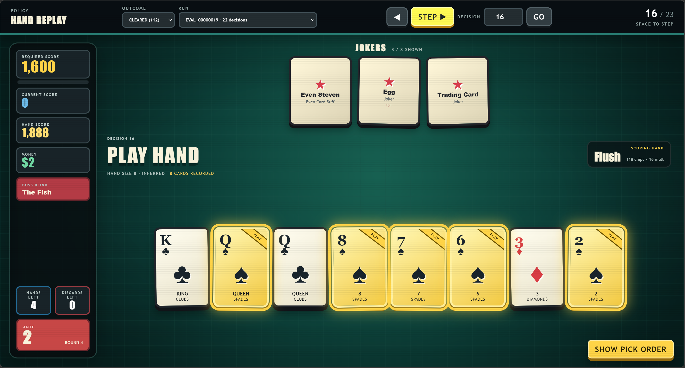
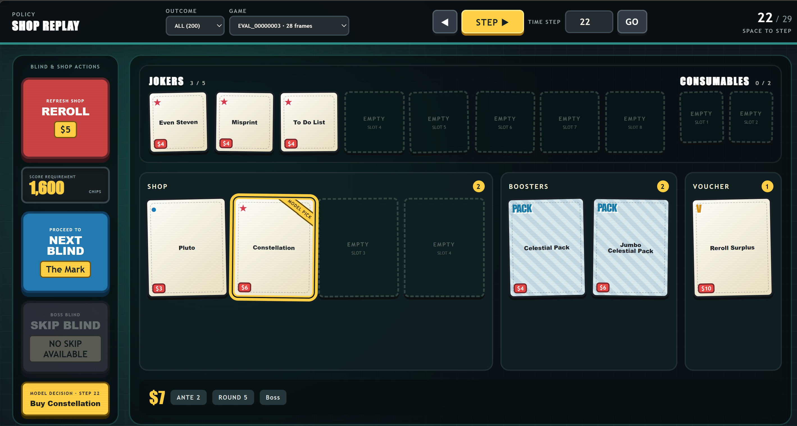

# Balatro RL using Jackdaw

## Description

Balatro RL environments using the Jackdaw Balatro engine. Contains:
* Shop Agent adapter to train on the shop state
    * Various forms of reward shaping including ante-based rewards, punishments for heuristically bad behavior (overskipping, buy/sell), altered win antes, etc. 
* Hand Agent
    * Combinatorial solver (hand templates + heuristics sampled over shuffled draws) for play-discard economy and clear rate maximization
    * Behavior cloning module for training on solved data
    * Autoregressive pointer for hand selection
    * Reward is clearing the current blind + an optional money-aware objective from the shop agent
* Data Analysis Tools
    * Script to export hand and shop decisions
    * Local website to view decisions in a slideshow
    * Eval script to benchmark agents
    * Various bespoke tools to address issues that came up (build diversity issues when expanding the win horizon, runtime estimates for solver setups, checking for effects of known biases after training, etc.)
* A few engine fixes and alterations

## Images of (Vibecoded) Decision Slideshows 

