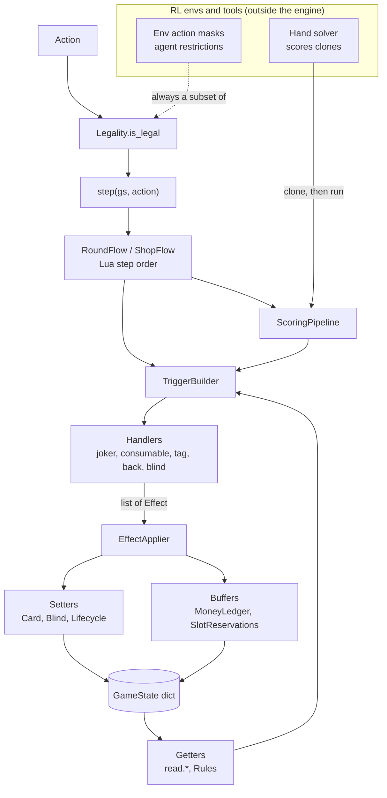
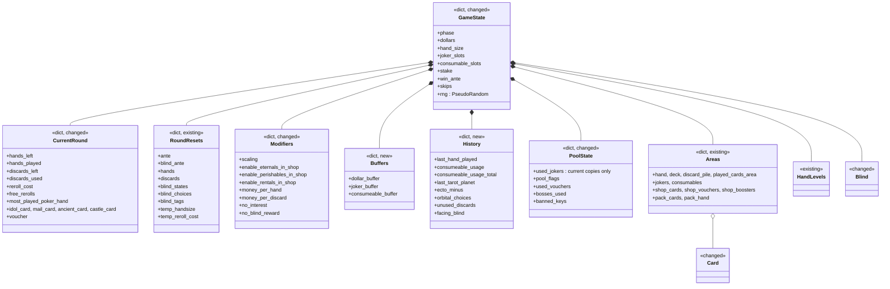
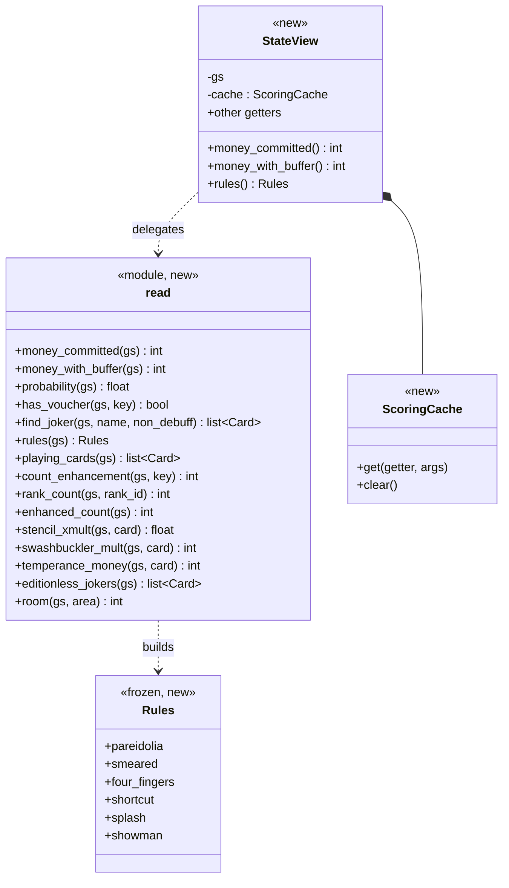
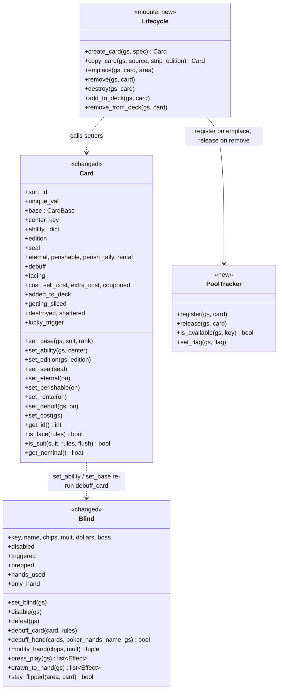
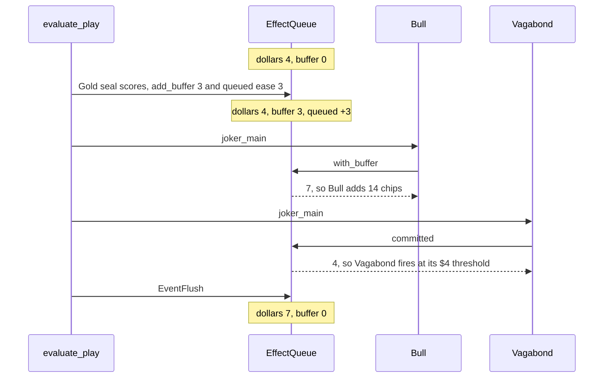
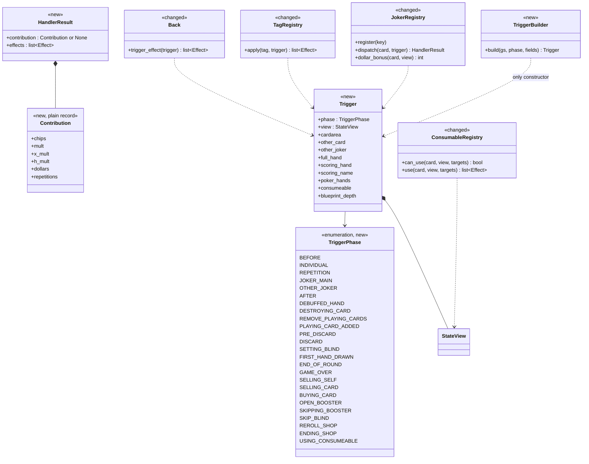
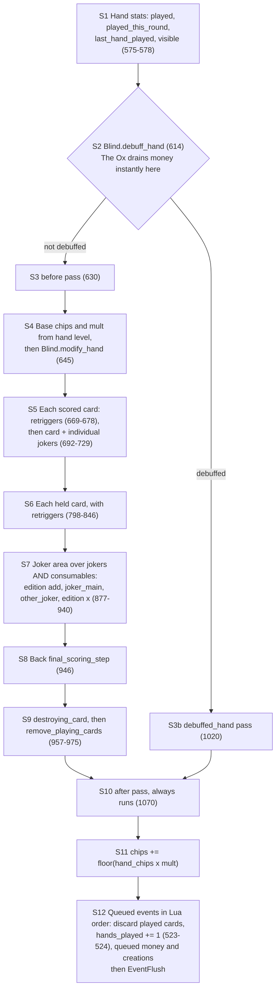
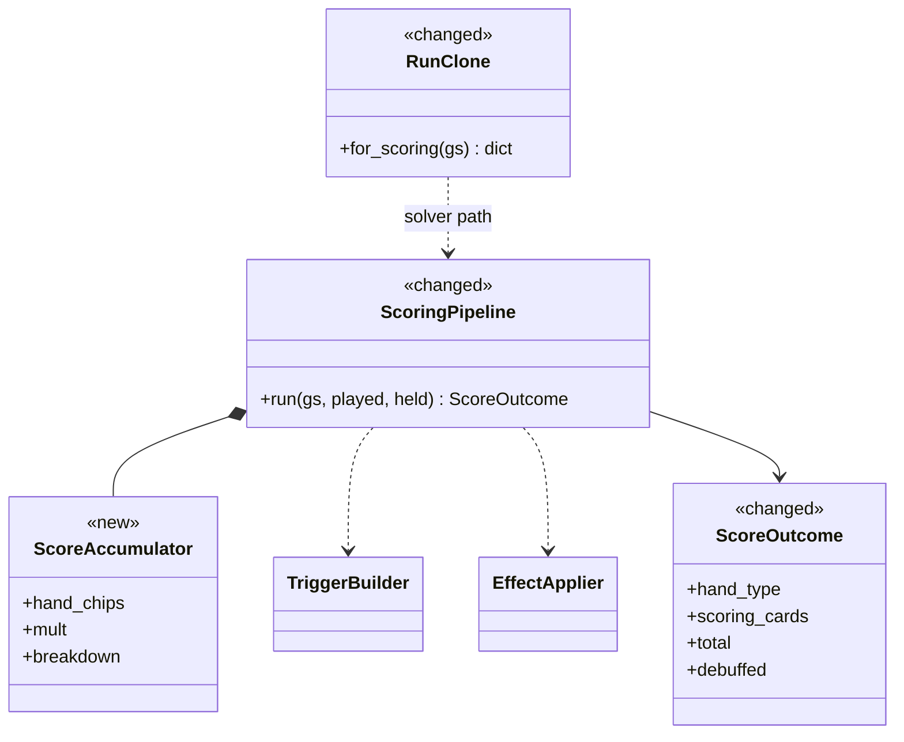
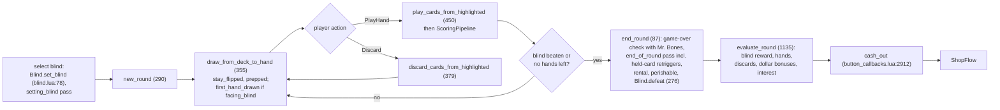
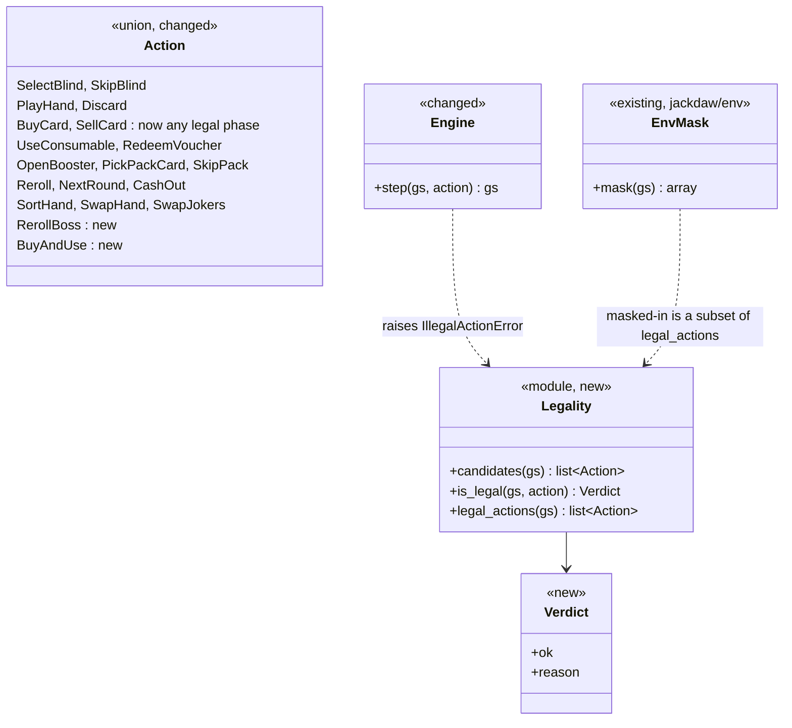

# Engine class design

Date: **2026-10-06**. Companion to
[`engine_fixing_plan_2026-10-06.md`](engine_fixing_plan_2026-10-06.md).
Status: **draft for review**. Nothing here is built yet.

Target shape (user, 2026-10-06): *setters, getters, a clean scoring pipeline
and correct buffers; tests on the OOP.* Decisions this design assumes, all
agreed 2026-10-06:

- Game state stays a plain dict. Every read goes through getters
  ("grabbers").
- Every change to a card goes through setters.
- Effects are an `Effect` base class with one subclass per effect kind,
  applied by one applier.
- Lua's `dollar_buffer`, `joker_buffer` and `consumeable_buffer` are real state
  with Lua's semantics.
- Shop pool exclusion matches Lua (excluded only while a copy exists).
- The engine allows every vanilla action; RL env masks hold agent
  restrictions.
- Challenges, profiles, endless and the `CardArea` helpers raise instead of
  diverging.

Stereotypes used below: `new` (does not exist yet), `changed` (exists, gets
reworked), `existing` (kept as is). `dict` marks a conceptual grouping of keys
inside the game-state dict, not a Python class. Lua references are to the
1.0.1o source (`balatro_source/Balatro`).

---

## 1. Layers and call flow

One path per job: actions are checked by **Legality**, executed by the
**flows** in Lua's step order, which build **Triggers**, call **handlers**,
and hand the returned **Effects** to one **EffectApplier**. The applier
changes state only through **setters** and the **buffers**. Everything that
reads state goes through **getters**.

---

## 2. Game state

Still one dict. These "classes" are the documented key groups inside it, so a
pickled blob keeps working. **Naming rule (proposed):** a key that mirrors a
`G.GAME` field uses Lua's exact name, typos included (`consumeable_*`). The
state inventory then maps one-to-one with no translation table to drift.

`History` gathers the fields Part 1b of the plan found missing or never
written. Aliases (`probabilities_normal`, flat `enable_*_in_shop`,
`omen_globe`, `has_*` flags, flat `free_rerolls`, `playing_card_count`,
`consumable_usage_*`) are removed. The mirror keys (`gs["money"]`,
`gs["hands_left"]`, the tallies) are deleted.

---

## 3. Getters

Pure functions of the state, so they can never be stale. They cover every
value Lua recomputes per frame in `Card:update` (`card.lua:4126–4260`) and
every "has X" flag. A `StateView` is what handlers see. During one scoring run
it memoises getter results in a `ScoringCache` that is thrown away afterwards.
That keeps the solver's inner loop cheap without anything going stale between
plays.

Rule for every getter: count exactly what Lua's loop counts. Lua's update loop
does not skip debuffed jokers, so Stencil, Swashbuckler and the
`editionless_jokers` list include them (fixes D10, D39).

---

## 4. Setters: Card, Blind and Lifecycle

Lua bundles bookkeeping into its `Card:*` and `Blind:*` methods, so ours do
the same. Card setters take `gs` because their bookkeeping touches the run:
a Negative edition changes `joker_slots` only when the card is already
`added_to_deck`, and a debuff toggles the card's passives. The `Lifecycle`
module is the only way to create, copy, place or remove a card, and it fires
the `playing_card_added` / `remove_playing_cards` triggers itself.

Lua anchors: `Card:set_base` `card.lua:97`, `set_ability` `:223`,
`set_cost` `:369`, `set_edition` `:387`, `set_eternal` / `set_perishable` /
`set_rental` `:506–521`, `set_debuff` `:526`, `add_to_deck` `:564`,
`remove_from_deck` `:645`, `remove` `:4727`; `copy_card`
`common_events.lua:2156`; `create_card` `:2082`; `Blind:set_blind`
`blind.lua:78`, `defeat` `:276`, `disable` `:356`, `press_play` `:464`,
`debuff_hand` `:519`, `drawn_to_hand` `:572`, `stay_flipped` `:605`,
`debuff_card` `:624`.

Lint (test): no assignment to `.edition`, `.debuff`, `.seal`, `.ability`,
`.base`, sticker fields, or a bare `Card(` outside `card.py`, `lifecycle.py`
and `card_factory.py`.

---

## 5. Buffers

The built engine keeps all three Lua buffer views on the pass-local
`EffectQueue`, not in persistent game state. `reserved` models
`joker_buffer`/`consumeable_buffer`; `pending_dollars` models this pass's
explicit producer-side `dollar_buffer` reservations; and `instant_dollars`
models committed-view changes such as The Ox. `committed()` and
`with_buffer()` are allocation-free reads over live dollars plus those local
deltas. Stable `gs["dollar_buffer"]` remains zero, which prevents a solver
probe against live `gs` from leaking state.

`EaseDollars(buffered=True)` is used only by producers that explicitly add to
Lua's buffer. Ordinary deferred eases (Tooth, discard costs, rental, held Gold)
remain unbuffered; `instant=True` changes the queue's committed view at
emission. `EffectQueue.apply()` is the event flush and commits effects in FIFO
order. Buffer-clear events are coalesced into the queue reset: no F1/F2 money
observer runs among those clears and commits, while dollar commits retain
their Lua order.

Why both views exist (your Vagabond note, confirmed in the source): a Gold
seal scores during `evaluate_play`. Bull reads `dollars + dollar_buffer`
(`card.lua:3936`) and sees the payout. Vagabond reads `dollars`
(`card.lua:3744`) and does not. The Ox drains instantly
(`ease_dollars(-dollars, true)`, `blind.lua:565`), so both see $0 after it.

---

## 6. Effects

An `Effect` is a **change to the game state**: one subclass per kind of
change. `apply` is abstract, so a new kind cannot exist without its
application code, and an unknown effect cannot reach the applier. `reserve`
runs when the effect is queued. `CreateCard` uses it to take a slot before any
RNG is drawn (fixes D46).

Scoring numbers (chips, mult, x_mult, retriggers) are **not** effects. They
are values the scoring pipeline folds into the running total itself, in Lua's
order (section 8).

The built API uses one pass-local `EffectQueue`. It owns pending effects,
money views, and Joker/Consumable slot reservations; reservations do not live in `gs`, so
a solver can score cloned objects against a live state without leaking buffer
changes. `apply_effects` (called by `EffectQueue.apply`) is the only applier.

The concrete vocabulary is `EaseDollars`, `SetDollars`, `AddChips`, `CreateCard`,
`CreatePlayingCard`, `CreatePlayingCards`, `CopyCard`, `AddTag`, `DestroyCard`,
`DestroyPlayingCards`, `SetEnhancement`, `ChangeSuit`, `ChangeRank`, `SetSeal`,
`SetEdition`, `LevelUpHand`, `ChangeRoundResource`, `ChangeHandSize`,
`DisableBlind`, and `SetPoolFlag`. Card lifetime effects delegate to
`lifecycle.py`, including the follow-up joker notifications created by adding
or destroying playing cards.

`SaveRun` is deliberately not an effect. Mr. Bones' `saved` value remains a
scoring-pipeline result until Phase 5 C11 defines the surrounding game-over
event. There are likewise no draft-only `EffectApplier`, `ApplyContext`,
`CardSpec`, `ModifyCard`, or `DiscardCards` types in the Phase 4 build.

Card effects create follow-up triggers (a created playing card fires
`playing_card_added`, a destroyed batch fires `cards_destroyed`). The applier
runs those through the same path, so they cannot be skipped (fixes D17).

---

## 7. Triggers and handlers

`Trigger` replaces `JokerContext` + `GameSnapshot`. Its only constructor is
`TriggerBuilder.build`, which fills every field from live state through a
`StateView`. A handler never sees a field that a caller forgot to fill.

A handler returns a `HandlerResult`, the same shape as Lua's return table:
the numbers it reports (`Contribution`), if the trigger is a scoring one, and
the state changes it causes (`list[Effect]`). A `Contribution` is a plain
record with no logic. It says what this card or joker adds, and the pipeline
decides how and when that is applied. Nothing is accumulated or combined
before the pipeline folds it into the running chips and mult.

The copy jokers (Blueprint, Brainstorm) dispatch the target's handler with
`blueprint_depth + 1` through the engine's existing `resolve_copy_targets`.
Spurious `not blueprint` guards are removed (D06).

---

## 8. Scoring pipeline

`ScoringPipeline.run(gs, played, held)` follows `evaluate_play`
(`state_events.lua:571`) stage by stage. It changes the state it is given,
as Lua does (Vampire strips enhancements before cards score, the before pass
can level the hand), so the solver gives it a clone. The `ScoreAccumulator`
holds the running `hand_chips`, `mult` and the breakdown.

In the built function, scoring payouts are `EaseDollars` effects emitted at
their Lua call sites. `ScoreResult.dollars_earned` is derived from its
non-instant dollar effects. DNA is the other synchronous special case: its
before-pass copy enters the live hand through lifecycle (or only the solver's
cloned held list), so the held-card loop scores it immediately without
touching live solver state.

**The pipeline owns every ordering rule.** It walks the scored cards in play
order (left to right), then the held cards in hand order, then the jokers left
to right followed by the consumables. At each card or joker it asks the
handlers for their `Contribution` and folds the numbers into the running total
immediately, in Lua's fixed order:

- **A scored card** (`state_events.lua:704–776`): chips, mult, money, extra,
  x_mult, then the card's edition (its chips, then mult, then x_mult). Example:
  a Glass card (x2) with a Holographic edition (+10 mult), reached at mult 10,
  gives (10 × 2) + 10 = **30**, never (10 + 10) × 2. The rule lives in the
  pipeline, so the same card always scores the same way.
- **A held card** (`798–846`): money, held mult, then x_mult.
- **A joker** (`877–940`): its edition's chips and mult, then its own
  `joker_main` numbers (mult, chips, x_mult), then other jokers reacting to it
  (`other_joker`), then its edition's x_mult.
- **Retriggers:** the pipeline asks for `repetitions` first, then repeats the
  whole card step that many times (`669–678`, `813–823`).

Handlers never apply anything to the score. They only report.

This removes the invented `individual_hand_end` stage (C03), runs the after
pass for blocked hands (D12), puts The Ox before scoring (D29), moves the
counters after scoring (C01), and includes consumables in the joker pass
(Observatory, C13).

`RunClone.for_scoring` replaces today's per-object `fast_clone_*` helpers. It
clones exactly what scoring can change, buffers and history included. A test
pins it: running the pipeline on the clone must leave the original state
byte-identical, and must produce the same outcome as running on a deep copy.

### What one scored hand changes

This is the list `RunClone.for_scoring` must copy, and the list a solver
probe must never leak into the real run. Built from `evaluate_play`
(`state_events.lua:571`) and the joker contexts it fires (`card.lua`):

| State | What changes | Examples (Lua line) |
|---|---|---|
| `HandLevels` | `played`, `played_this_round`, `visible`; level up or down | stats `575–578`; Space Joker levels up in the before pass (`card.lua:3420`); The Arm levels down (`debuff_hand`) |
| `History` | `last_hand_played` | `state_events.lua:576` |
| `Blind` | `triggered`, `hands_used` (The Eye), `only_hand` (The Mouth) | `blind.lua:519` |
| Money | instant drain; queued payouts; `dollar_buffer` | The Ox (`blind.lua:565`); Gold seal, Lucky, Golden Ticket, Business Card, Rough Gem, To Do List, Matador |
| Played cards | enhancement, `perma_bonus`, `lucky_trigger`, destroyed | Midas Mask turns faces Gold and Vampire strips enhancements, both in the before pass (`3443`, `3465`); Hiker (`3067`); Glass shatter; Sixth Sense |
| Joker abilities | scaling counters | before pass: Spare Trousers, Square, Runner, Ride the Bus, Obelisk, Green Joker (`3412–3563`); individual: Lucky Cat, Wee Joker (`3076`, `3083`); joker_main: Loyalty Card (`3632`); after pass: Ice Cream, Seltzer (`3571`, `3601`) |
| Jokers | removed | Ice Cream and Seltzer run out in the after pass |
| Areas and pool | new consumables or playing cards; destroyed cards leave every area | 8 Ball (`3106`), Superposition, Vagabond, Séance, Sixth Sense, DNA (`3501`); consumables register in `used_jokers` |
| Buffers | `consumeable_buffer`, `dollar_buffer` | 8 Ball checks `#consumeables + consumeable_buffer` (`3106`) |
| `rng` | named streams advance | `lucky_*`, `glass`, `8ball`, `space`, `bloodstone`, `business`, … |
| `chips` | round total | `state_events.lua:1049` |

Untouched by scoring: shop areas, vouchers, tags, `round_resets`, blind
choices, stake and deck modifiers, starting params. A probe test asserts these
are byte-identical after a run.

The hand counters (`hands_played`) and the move of played cards to the discard
pile happen in the queued event right after `evaluate_play`
(`state_events.lua:523–524`). They belong to the play step, not to the
pipeline, so the solver's clone does not need them.

---

## 9. Round flow

Line-faithful ports of Lua's top-level functions. Shared steps exist once:
one draw function (with `stay_flipped`, `prepped`, debuff), one discard
function (The Hook calls it with `hook=True`).

---

## 10. Actions and legality

One predicate decides legality. `step` raises when it says no, and
`legal_actions` is the candidates it says yes to, so the two cannot drift. The
engine exposes the full vanilla action set. Each RL env keeps its own mask,
pinned to exactly today's legal sets, so no checkpoint changes.

---

## 11. Tests on the OOP

Each class gets a suite that tests it through its public methods, plus three
structural tests that make the one-path rules impossible to bypass.

| Class or module | Suite | What it pins |
|---|---|---|
| `GameState` key groups | `test_state_completeness` | every Lua `G.GAME`, `Card` and `Blind` field is mapped to a key, a getter, or out of scope; no aliases |
| `read.*`, `Rules`, `StateView` | `test_getters` | each getter against a hand-built state, matching the Lua `Card:update` value, debuffed cards counted where Lua counts them |
| `Card` setters | `test_card_setters` | Negative changes slots only when `added_to_deck`; `set_debuff` removes and restores passives; an expired perishable cannot be un-debuffed; sticker compatibility |
| `Lifecycle`, `PoolTracker` | `test_lifecycle` | create, copy and destroy keep slots, pool and notifications right; copies get a fresh identity; pack-open cards go to `pack_hand`; a sold joker returns to the pool (C06) |
| `Blind` | `test_blind` | `disable` reverses Wall-style effects (C08); `defeat` cleanup; `stay_flipped` on every draw (C09); a boss below its `min` ante cannot be set |
| `MoneyLedger`, `SlotReservations`, `EventFlush` | `test_buffers` | the Bull / Vagabond / Ox scenario above; Riff-raff plus Cartomancer in one pass; reservation before RNG (D46) |
| `Effect` subclasses | `test_effects` | each subclass applied to a minimal state; `Effect` cannot be instantiated without `apply` |
| `EffectApplier` | `test_effect_applier` | producer/consumer: every effect type any handler returns is applied at every call site that can fire it; follow-up triggers fire |
| `TriggerBuilder`, `Trigger` | `test_triggers` | `build` is the only constructor; every field matches live state |
| `ScoringPipeline`, `RunClone` | `test_scoring_pipeline` + Lua oracle | state after each stage matches Lua `evaluate_play`; per-card trait order and per-joker order match Lua; the clone leaves the original untouched |
| `RoundFlow`, `ShopFlow` | `test_round_flow` + Lua oracle | `end_round`, draw, discard and cash-out order and state match Lua |
| `Legality` | `test_legality` | `step` raises if and only if `is_legal` says no; `legal_actions` equals the filtered candidates; every env mask is unchanged |
| whole engine | `test_engine_lint` | no direct `gs[...]` reads in handlers; no direct card-field writes outside setters; no `JokerResult.extra`-style untyped channels |

---

## 12. Review decisions (2026-10-06)

1. **Lua's exact key names** for every `G.GAME` mirror, typos included
   (`consumeable_usage`). **DECIDED: yes.** The inventory maps one-to-one.
2. **Setters change the game state directly.** `card.set_edition(gs, …)`
   itself adjusts `joker_slots`, as Lua's methods reach the global `G`.
   **DECIDED: yes.**
3. **Scoring order lives in the scoring function.** **DECIDED (user):**
   `ScoreDelta` is dropped. Handlers report a plain `Contribution` record (what
   this card or joker adds, no logic), and the pipeline applies it to the
   running total at once, in Lua's order, including the order of one card's
   own traits (section 8). Effects are only for state changes.
4. **The pipeline changes the state it is given**, and the solver passes a
   `RunClone`. **DECIDED (user): fine, provided the order is precise and
   correct.** The order is pinned by the Lua oracle comparing state after every
   stage (section 11). See section 8, "What one scored hand changes".
5. **`Blind` methods return effects**, so The Hook becomes
   `DiscardCards(hook=True)` through the normal discard path.
   **DECIDED: yes** (fixes D31).

---

## 13. Edge cases the interpreters and setters must handle

User direction (2026-10-06): *careful implementation of interpreters and
setters, especially in edge cases.* Each line below becomes a named test in
the class's suite (section 11), written to fail on today's engine first.

### Setters (`Card`, `Blind`)

- `set_edition` Negative: changes `joker_slots` (or `consumable_slots`) only
  if the card is `added_to_deck`. A shop card gains the slot when bought.
  Replacing Negative with another edition gives the slot back, with Lua's
  `queue_negative_removal` timing (`card.lua:632, 689, 4733`). Foil, Holo and
  Polychrome set their scoring values (C12).
- `set_debuff(True)` on a joker runs `remove_from_deck(from_debuff)`: hand
  size, discards, Oops, Credit Card and Chaos passives switch off, and come
  back on `set_debuff(False)` (D25).
- An expired perishable has `perma_debuff` and cannot be un-debuffed, not even
  by a blind's clear-all (`card.lua:526–538`; D25).
- `set_ability` / `set_base` on a card in hand during a boss re-runs
  `debuff_card` (Plant, Goad, suit bosses; D36). Converting to Stone removes
  rank and suit for face and suit checks (D02). Wild counts as every suit for
  flushes. Stone never does.
- `set_base` keeps `suit_nominal_original` and updates `card_key` (D41).
- `set_eternal` / `set_perishable` respect `eternal_compat` /
  `perishable_compat` and exclude each other (D47).
- `set_cost`: a `couponed` card stays free across repricing (D53). Astronomer
  makes Planets and Celestial packs free (C13). Clearance Sale and
  Liquidation reprice what is already in the shop (D51).
- `Blind.disable` undoes set-time effects: The Wall's size, The Water's
  discards, The Needle's hands, The Manacle's hand size. Chicot bought during a
  boss disables it immediately (C08).
- `Blind.defeat` restores flipped cards and jokers and clears boss debuffs
  (D32). Pillar's played-this-ante markers reset at the new ante (D30).
- A boss whose `min` ante is above the current ante cannot be set (your C08
  note).

### Lifecycle

- `copy_card` gives a fresh `sort_id` and `unique_val`, deep-copies `ability`
  (no shared dicts: Perkeo, D24), and can strip the edition (Ankh strips
  Negative, D35). The copy is `added_to_deck`, so a copied Juggler adds its
  hand size.
- `destroy` releases the pool entry only when no other copy remains (C06). It
  fires `remove_playing_cards` for playing cards. Glass Joker counts only
  shattered Glass cards. Eternal jokers survive Madness, Ceremonial Dagger and
  Ankh. `getting_sliced` is set first, so a dying joker does not fire its own
  `setting_blind` (D15).
- `emplace` routes created playing cards to `pack_hand` while a pack is open
  (D37). It does not enforce the hand limit: DNA and Cryptid can overfill the
  hand, as in Lua.
- Turtle Bean's decay changes the live hand size each round (D20).

### Interpreters (`EffectApplier`, `Effect` subclasses)

- `CreateCard` into a full area draws no RNG and registers nothing (D46).
  Room is limit − cards − buffer, checked **before** the edition roll, so a
  joker that would have rolled Negative cannot squeeze into a full row.
- Several creators in one pass share the buffer: Riff-raff with Cartomancer,
  or 8 Ball firing on several retriggers.
- Retriggers (`repetitions`): Red seal and Mime also repeat held cards at end
  of round (C10). Hanging Chad repeats the first scored card only. A Blueprint
  copy's retrigger counts separately.
- `EaseDollars`: instant vs queued vs buffered, as in section 5. The Ox drains
  to $0 before scoring (D29). The balance can go negative down to
  `bankrupt_at` (Credit Card, D50).
- `DestroyCard` during scoring: the destroyed card still scored this hand and
  leaves every area afterwards. Sixth Sense creates its Spectral only if there
  is room (C02).
- `LevelUpHand` in the before pass changes base chips before any card scores.
  The Arm never goes below level 1. Level-ups do not reveal secret hands;
  playing them does (D13).
- `DiscardCards(hook=True)` runs the discard pipeline (Purple seal, Mail-In
  Rebate, discard scaling) but skips Burnt Joker and does not use up a discard
  (D31).
- `SaveRun` (Mr. Bones) fires only in `end_round`'s game-over check, and only
  if `chips / blind.chips >= 0.25` (`card.lua:3047`), on the round's
  accumulated chips (C11).
- An unknown `Effect` type raises. A handler that returns nothing applies
  nothing.

### Scoring

- One card's traits apply in Lua's order: Glass (x2) plus Holographic
  (+10 mult) at mult 10 gives 30, and Mult enhancement (+4) plus Polychrome
  (x1.5) at mult 10 gives (10 + 4) × 1.5 = 21.
- A blocked hand still runs the after pass (D12). Matador also pays in the main
  pass when `blind.triggered` (D11).
- A debuffed joker gives nothing itself, but is still a target for
  `other_joker` (Baseball Card, D10).
- Blackboard passes with an empty held hand (D09). Raised Fist picks the
  **last** tied lowest card (D08). Brainstorm in the leftmost slot copies
  nothing (D05).
- Vampire strips and Midas Mask gilds in the before pass, so the changed
  cards score in their new form the same hand (C03).
- Stencil and Swashbuckler count debuffed jokers, as Lua's update loop does
  (D10).
